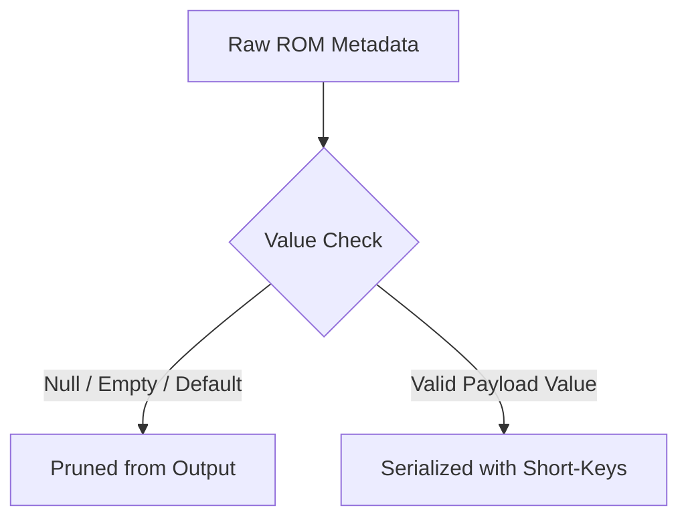

# Data Management Manifest: Newline-Delimited Sparse JSONL ROM Database

This manifest describes the architecture, minified short-keyed JSONL schema specifications, and performance guidelines for consuming and maintaining the optimized consolidated ROM metadata databases generated by the `APIExpose` pipeline inside RetroBat.

---

## 📂 1. Directory Structure & Architecture

All consolidated ROM databases are generated on a system-by-system basis to optimize memory efficiency during compilation.

```
E:\RetroBat\plugins\APIExpose\projects-source\gamelist-build-filters\multi\
├── consolidate_systems.py       # Metadata aggregation & compilation script
├── systems/                     # Target Output Folder (Optimized Sparse JSONL)
│   ├── snes.json                # Super Nintendo database
│   ├── megadrive.json           # Sega Genesis / Mega Drive database
│   ├── mame.json                # Arcade MAME database (~60,000+ entries)
│   └── [system_name].json       # Other systems...
```

Runtime copies consumed by the API live under:

```
E:\RetroBat\plugins\APIExpose\resources\gamelist\
├── systems/                     # Current API runtime lightweight *_lt JSONL files
├── systems_data_references/     # Extracted/reference JSON metadata
└── DATA_MANIFEST.md             # Runtime schema contract
```


### System aliases

Some RetroBat folders share the same ROM metadata source (`amiga500 -> amiga`, `genesis -> megadrive`, `model2 -> arcade`, etc.).

By default, `consolidate_systems.py` writes one canonical JSONL file plus a lightweight `aliases.json` manifest instead of duplicating the same large JSONL content under every alias.

Example:

```json
{
  "amiga500": { "jsonl": "amiga_lt.json", "full": "amiga.json" },
  "genesis": { "jsonl": "megadrive_lt.json", "full": "megadrive.json" }
}
```

Use `--materialize-aliases` only when a full physical JSONL file is explicitly required for each alias. Use `--light-only` to generate only the runtime `*_lt.json` files. A full non-sample run copies `*_lt.json` and `aliases.json` to `resources/gamelist/systems` unless `--no-runtime-copy` is passed.`r`n`r`n### âš¡ Format: Sparse Newline-Delimited JSON (JSON Lines)
- Each `.json` file is a **newline-delimited JSON document** (containing one flat, compact JSON object per line).
- **CRITICAL**: Do **NOT** load the entire file as a single JSON array using standard DOM parser APIs (e.g., `JsonConvert.DeserializeObject<List<Rom>>`), as files like `mame.json` will exceed memory constraints.
- **SOLUTION**: Stream through the file line-by-line, parsing each line independently.

### Filename enrichment pass

`consolidate_systems.py` enriches sparse fields from ROM names when source data is incomplete:

- `reg` is parsed from explicit region tags such as `(USA)`, `(Europe)`, `(Japan)` and `(World)`.
- `lang` is parsed from language tags such as `(En,Fr,De,Es,It,Pt)` and from slug-like `id/set` values when several language codes are present.
- Ambiguous short tokens such as `Fr`, `De`, `Es` and `It` are treated as languages in filename tags, not as regions. Explicit country names such as `France`, `Germany`, `Spain` and `Italy` remain regions.
- `rev`, `ver`, `bld`, `rk` and `flg` are also inferred from common filename markers such as `Rev`, `v1.0`, `Beta`, `Proto`, `Demo`, `Hack`, `Trainer`, `Unlicensed`, `Homebrew`.
- GoodTools/TOSEC-style tags enrich quality and variant flags: `[!]`, `[a]`, `[b]`, `[o]`, `[f]`, `[h]`, `[t]`, `[p]`, `[cr]`.
- Distribution markers such as `Virtual Console`, `Nintendo Switch Online`, `PSN`, `XBLA`, `WiiWare`, `DSiWare`, `eShop`, `DLC`, `Update`, `Kiosk` and `Not For Resale` enrich `flg`, `rk`, `dst` and `t` when reliable.
- Mobile/J2ME device hints such as `(LG KE970, 240x304)` are stored in full JSON under `mob`; they are omitted from `_lt` until a real ES filter consumes them.

---

## 🚀 2. Sparse Architecture & Optimization Rules

To maximize serialization speed and minimize database footprint (saving ~85% disk space and transit memory), the pipeline uses a **Sparse JSONL Architecture with Compact Parameters**:



### 🪓 Omission and Pruning Rules:
1. **Omission of DAT properties**: The redundant `"dat"` parent object (containing DAT filenames/versions/URLs) has been completely removed from individual entries.
2. **Implicit Defaults**: Standard default states are pruned from the JSONL structure. If the C# backend encounters a missing property, it must assign the following defaults:
   - `run` (runnable) defaults to `true`
   - `off` (official) defaults to `true`
   - `sc` (stable_candidate) defaults to `true` (if omitted for retail games)
   - `ori` (orientation) defaults to `"horizontal"`
   - `role` defaults to `"parent"`
   - `edt` (edition_type) defaults to `"normal"`
   - `rk` (release_kind) defaults to `"retail"`
   - `dst` (distribution) defaults to `"retail"`
3. **Empty Payloads**: Any fields holding `null`, empty arrays (`[]`), or empty objects (`{}`) are completely excluded.
4. **Canonical System**: If `csys` is identical to `sys`, it is pruned to avoid string duplication.

---

## 📋 3. Compact Schema Definition & Parsed Taxonomic Map

Below is the complete taxonomical mapping for every consolidated ROM entry in the **compact minified schema**.

> [!NOTE]
> Since this is a **Sparse Schema**, all fields except core identifiers (`sys`, `id`, `n`, `fn`, `sn`) are optional and will only appear in the JSON payload when they carry non-default, valid values.

| Short Key | Full Parameter Name | Data Type | Default / Fallback | Description |
|---|---|---|---|---|
| `sys` | `system` | `string` | **Required** | RetroBat identifier for the system (e.g. `"snes"`). |
| `csys` | `canonical_system` | `string` | Fallback to `sys` | Standardized system name (omitted if identical to `sys`). |
| `grp` | `group` | `string` | `""` | Parent group for handling variant clustering and clones. |
| `id` | `id` | `string` | **Required** | Unique identifier key generated for this ROM. |
| `n` | `name` | `string` | **Required** | Cleaned game name without parenthetical tags. |
| `fn` | `full_name` | `string` | **Required** | Full ROM name with parenthetical regional/clone details. |
| `sn` | `sort_name` | `string` | **Required** | Standardized sorting title (cleaned title). |
| `t` | `type` | `string` | `"game"` | Content classification: `"game"`, `"hack"`, `"prototype"`, `"homebrew"`. |
| `pf` | `platform_family`| `string` | `null` | Machine hardware parent family classification. |
| `cf` | `collection_families` | `array [string]`| `[]` | Grouped franchise lists (e.g. `["Final Fantasy", "Square RPG"]`). |
| `role` | `role` | `string` | `"parent"` | Clone status: `"parent"`, `"clone"`, `"variant"`, `"bios"`. |
| `cof` | `cloneof` | `string` | `null` | Unique parent ROM ID if this entry is a clone. |
| `mt` | `media_type` | `string` | `"cartridge"` | Hardware medium: `"cartridge"`, `"cdrom"`, `"disk"`, `"card"`. |
| `oe` | `original_extension` | `string` | `null` | The ROM's raw format extension (e.g., `".sfc"`, `".zip"`). |
| `ce` | `container_extension` | `string` | `null` | Compressed archive container extension. |
| **`dsc`** | **`disc`** | `object` | `null` | Sub-object containing disc info if multi-disk. |
| ↳ `n` | `number` | `int` | `null` | Specific disc/tape index for multi-disk systems. |
| ↳ `t` | `total` | `int` | `null` | Total count of discs/tapes in the set. |
| ↳ `l` | `label` | `string` | `null` | Disc name label (e.g., `"Disk A"` or `"Side B"`). |
| `reg` | `regions` | `array [string]`| `[]` | Extracted regional release arrays (e.g. `["Japan", "USA"]`). |
| `lang` | `languages` | `array [string]`| `[]` | ISO 2-letter lowercase language codes (e.g. `["en", "ja"]`). |
| `lo` | `language_origin`| `string` | `"original"` | Context if translated (e.g. `"translation"`). |
| `rev` | `revision` | `string` | `null` | Revision version identifier label (e.g., `"Rev A"`). |
| `revr` | `revision_rank` | `int` | `0` | Hierarchy rank weight of the software revision. |
| `ver` | `version` | `string` | `null` | Exact parsed program version (e.g., `"v1.0.3"`). |
| `verr` | `version_rank` | `array [float]` | `[0.0, 0.0]` | Hierarchy comparison score vector (e.g. `[1.03, 1.03]`). |
| `set` | `set` | `string` | **Required** | Full code/checksum set tracking hash key. |
| `bld` | `build` | `string` | `null` | Exact parsed build label iteration (e.g. `"Beta 1"`, `"Proto 3"`, `"Demo 2"`). |
| `bldr` | `build_rank` | `int` | `10` | Rank indicating development tier (e.g. retail=10, beta=5, alpha=3, proto=1). |
| `rd` | `release_date` | `string` | `null` | Extracted release date formatted as `YYYY-MM-DD`. |
| `ry` | `release_year` | `int` | `null` | Extracted release year integer. |
| `ed` | `edition` | `string` | `null` | Special game edition label (e.g., `"Fan Translation"`, `"Hack / Mod"`). |
| `edt` | `edition_type` | `string` | `"normal"` | Classification (e.g., `"translation_patch"`, `"hack_patch"`). |
| `y` | `year` | `int` | `null` | Simplified launch year reference. |
| `mfr` | `manufacturer` | `string` | `null` | System hardware manufacturer. |
| `pub` | `publisher` | `string` | `null` | Game publishing house. |
| `dev` | `developer` | `string` | `null` | Development studio or author. |
| `cat` | `categories` | `array [string]`| `[]` | Taxonomic genres (e.g., `["Sports", "Racing"]`). |
| **`pl`** | **`players`** | `object` | `null` | Sub-object for player counts. |
| ↳ `min` | `min` | `int` | `1` | Minimum players required. |
| ↳ `max` | `max` | `int` | `1` | Maximum players supported. |
| `coop` | `cooperative` | `boolean` | `false` | True if the game supports cooperative multiplayer. |
| `age` | `esrb` | `string` | `null` | ESRB age rating (e.g. `"Everyone"`, `"Teen"`, `"Mature"`). |
| `ar` | `aspect_ratio` | `string` | `null` | Target display aspect ratio (e.g. `"4:3"`, `"16:9"`). |
| `alt` | `alternate_names`| `array [string]`| `[]` | List of alternate/regional game titles. |
| `ori` | `orientation` | `string` | `"horizontal"` | Screen/cabinet view orientation: `"horizontal"`, `"vertical"`, `"cocktail"`. |
| `scr` | `screen_count` | `int` | `null` | Number of primary gameplay/display screens when greater than `1`. |
| `aux` | `auxiliary_features` | `array [string]` | `[]` | Auxiliary display/link/output features such as `"gamepad_screen"`, `"touchscreen"`, `"gba_link"`, `"vmu_screen"`, `"ticket_dispenser"`, `"coin_counter"`, `"meter"`. |
| `ctl` | `controllers` | `array [string]` | `[]` | Canonical controller/device tags compatible with the ROM. See controller taxonomy below. |
| `btn` | `buttons` | `int` | `null` | Maximum required gameplay button count, normalized to `0..12` when known. |
| `run` | `runnable` | `boolean` | `true` | Flag if the emulation engine can run the ROM directly. |
| `es` | `emulation_status`| `string` | `"good"` | System stability state: `"good"`, `"preliminary"`, `"imperfect"`. |
| `cs` | `compatibility_status`| `string` | `"good"` | Emulator runtime compatibility rank. |
| `off` | `official` | `boolean` | `true` | Flag if official original production release. |
| `sc` | `stable_candidate`| `boolean` | `true` | `true` if recommended as standard library ROM. |
| `rk` | `release_kind` | `string` | `"retail"` | Release/status classifier. Common values include `"retail"`, `"commercial"`, `"unlicensed"`, `"prototype"`, `"alpha"`, `"beta"`, `"demo"`, `"location_test"`, `"fan_translation"`, `"bugfix"`, `"quality_of_life"`, `"restoration"`, `"uncensored"`, `"widescreen"`, `"accessibility"`, `"compatibility_patch"`, `"trainer"`, `"cheat"`, `"randomizer"`, `"total_conversion"`, `"bootleg"`, `"pirate"`, `"homebrew"`, `"aftermarket"`, `"diagnostic"`. |
| `dst` | `distribution` | `string` | `"retail"` | Format of payload delivery: `"retail"`, `"patch"`, `"digital"`. |
| `flg` | `flags` | `array [string]`| `[]` | Status markers (e.g., `["hack", "unlicensed"]`). Fine-grained filters may use values such as `"beta"`, `"alpha"`, `"demo"`, `"location_test"`, `"bugfix"`, `"quality_of_life"`, `"restoration"`, `"uncensored"`, `"widescreen"`, `"trainer"`, `"cheat"`, `"randomizer"`, `"bootleg"`, `"pirate"`, `"homebrew"`, `"aftermarket"`, `"diagnostic"`, `"bad_dump"`, `"overdump"`, `"fixed_dump"`, `"verified_dump"`, `"alternate_dump"`, `"virtual_console"`, `"nintendo_switch_online"`, `"psn"`, `"xbla"`, `"wiiware"`, `"dsiware"`, `"eshop"`, `"dlc"`, `"update"`, `"not_for_resale"`, `"video_pal"`, `"video_ntsc"`, `"video_secam"`. |
| `cw` | `content_warnings`| `array [string]`| `[]` | Content warnings (e.g., `["casino", "gambling", "adult"]`). Also carries content categories useful to UX filters such as `"mahjong"` and `"quiz"`. |
| **`hk`** | **`hack`** | `object` | `null` | Sub-object for ROM modifications details. |
| ↳ `k` | `hack_kind` | `string` | `null` | Modification type: `"translation"`, `"hack"`, `"homebrew"`. |
| ↳ `t` | `hack_type` | `string` | `null` | Specific style context (e.g. `"trainer"`, `"quality_of_life"`, `"randomizer"`, `"widescreen"`). |
| ↳ `v` | `hack_version` | `string` | `null` | Author's mod release revision string. |
| ↳ `a` | `patch_authors`| `array [string]`| `[]` | Creators credited for the modification patch. |
| **`ra`** | **`retroachievements`**| `object` | `{"s": false}` | Sub-object for RetroAchievements integration. |
| ↳ `s` | `supported` | `boolean` | `false` | RetroAchievements support flag (`true`/`false`). |
| ↳ `id` | `game_id` | `int` | `null` | Unique RetroAchievements Game ID. |
| ↳ `h` | `hash` | `string` | `null` | RetroAchievements linked file hash. |
| ↳ `n` | `set_name` | `string` | `null` | Official RetroAchievements linked set name. |
| **`hsh`** | **`hashes`** | `object` | `null` | Checksums sub-object. |
| ↳ `crc` | `crc32` | `string` | `null` | 8-character uppercase CRC32 checksum. |
| ↳ `md5` | `md5` | `string` | `null` | 32-character MD5 checksum. |
| ↳ `sha1` | `sha1` | `string` | `null` | 40-character SHA-1 checksum. |
| **`sid`** | **`scrape_id`**| `object` | `null` | Metadata scraper identifiers. |
| ↳ `ss` | `screenscraper`| `string` | `null` | ScreenScraper database identifier. |
| ↳ `lb` | `launchbox` | `string` | `null` | LaunchBox database identifier. |
| ↳ `igdb` | `igdb` | `string` | `null` | IGDB database identifier. |
| `ser` | `serials` | `array [string]` | `[]` | Catalog/product serials parsed from names when reliable, e.g. `SLES-12345`, `SLUS-00000`, `NPUB12345`. Full JSON only; omitted from `_lt`. |
| **`mob`** | **`mobile_profile`** | `object` | `null` | J2ME/mobile profile parsed from names. Full JSON only; omitted from `_lt`. |
| ↳ `dev` | `device` | `string` | `null` | Device/model hint, e.g. `LG KE970`. |
| ↳ `res` | `resolution` | `string` | `null` | Target mobile resolution, e.g. `240x304`. |

---

## 🚀 4. High-Performance C# Integration (APIExpose Plugin)

To consume this compact minified sparse schema efficiently, use stream-reading inside your C# backend. Make sure your models use appropriate JSON attributes for handling missing keys or defaults.

```csharp
using System;
using System.IO;
using System.Collections.Generic;
using System.Text.Json;
using System.Text.Json.Serialization;

public class RomEntry
{
    [JsonPropertyName("sys")]
    public string System { get; set; }

    [JsonPropertyName("csys")]
    public string CanonicalSystem { get; set; }

    [JsonPropertyName("grp")]
    public string Group { get; set; } = "";

    [JsonPropertyName("id")]
    public string Id { get; set; }

    [JsonPropertyName("n")]
    public string Name { get; set; }

    [JsonPropertyName("fn")]
    public string FullName { get; set; }

    [JsonPropertyName("sn")]
    public string SortName { get; set; }

    [JsonPropertyName("t")]
    public string Type { get; set; } = "game";

    [JsonPropertyName("pf")]
    public string PlatformFamily { get; set; }

    [JsonPropertyName("cf")]
    public List<string> CollectionFamilies { get; set; } = new List<string>();

    [JsonPropertyName("role")]
    public string Role { get; set; } = "parent";

    [JsonPropertyName("cof")]
    public string CloneOf { get; set; }

    [JsonPropertyName("mt")]
    public string MediaType { get; set; } = "cartridge";

    [JsonPropertyName("oe")]
    public string OriginalExtension { get; set; }

    [JsonPropertyName("ce")]
    public string ContainerExtension { get; set; }

    [JsonPropertyName("dsc")]
    public DiscInfo Disc { get; set; }

    [JsonPropertyName("reg")]
    public List<string> Regions { get; set; } = new List<string>();

    [JsonPropertyName("lang")]
    public List<string> Languages { get; set; } = new List<string>();

    [JsonPropertyName("lo")]
    public string LanguageOrigin { get; set; } = "";

    [JsonPropertyName("rev")]
    public string Revision { get; set; }

    [JsonPropertyName("revr")]
    public int RevisionRank { get; set; } = 0;

    [JsonPropertyName("ver")]
    public string Version { get; set; }

    [JsonPropertyName("verr")]
    public List<float> VersionRank { get; set; } = new List<float> { 0.0f, 0.0f };

    [JsonPropertyName("set")]
    public string Set { get; set; }

    [JsonPropertyName("bld")]
    public string Build { get; set; }

    [JsonPropertyName("bldr")]
    public int BuildRank { get; set; } = 10;

    [JsonPropertyName("rd")]
    public string ReleaseDate { get; set; }

    [JsonPropertyName("ry")]
    public int? ReleaseYear { get; set; }

    [JsonPropertyName("ed")]
    public string Edition { get; set; }

    [JsonPropertyName("edt")]
    public string EditionType { get; set; } = "normal";

    [JsonPropertyName("y")]
    public int? Year { get; set; }

    [JsonPropertyName("mfr")]
    public string Manufacturer { get; set; }

    [JsonPropertyName("pub")]
    public string Publisher { get; set; }

    [JsonPropertyName("dev")]
    public string Developer { get; set; }

    [JsonPropertyName("cat")]
    public List<string> Categories { get; set; } = new List<string>();

    [JsonPropertyName("pl")]
    public PlayerInfo Players { get; set; }

    [JsonPropertyName("coop")]
    public bool Cooperative { get; set; } = false;

    [JsonPropertyName("age")]
    public string Esrb { get; set; }

    [JsonPropertyName("ar")]
    public string AspectRatio { get; set; }

    [JsonPropertyName("alt")]
    public List<string> AlternateNames { get; set; } = new List<string>();

    [JsonPropertyName("ori")]
    public string Orientation { get; set; } = "horizontal";

    [JsonPropertyName("scr")]
    public int? ScreenCount { get; set; }

    [JsonPropertyName("aux")]
    public List<string> AuxiliaryFeatures { get; set; } = new List<string>();

    [JsonPropertyName("run")]
    public bool Runnable { get; set; } = true;

    [JsonPropertyName("es")]
    public string EmulationStatus { get; set; } = "good";

    [JsonPropertyName("cs")]
    public string CompatibilityStatus { get; set; } = "good";

    [JsonPropertyName("off")]
    public bool Official { get; set; } = true;

    [JsonPropertyName("sc")]
    public bool StableCandidate { get; set; } = true;

    [JsonPropertyName("rk")]
    public string ReleaseKind { get; set; } = "retail";

    [JsonPropertyName("dst")]
    public string Distribution { get; set; } = "retail";

    [JsonPropertyName("flg")]
    public List<string> Flags { get; set; } = new List<string>();

    [JsonPropertyName("cw")]
    public List<string> ContentWarnings { get; set; } = new List<string>();

    [JsonPropertyName("hk")]
    public HackInfo Hack { get; set; }

    [JsonPropertyName("ra")]
    public RetroAchievementsInfo RetroAchievements { get; set; } = new RetroAchievementsInfo();

    [JsonPropertyName("hsh")]
    public HashInfo Hashes { get; set; }

    [JsonPropertyName("sid")]
    public ScraperIds ScrapeId { get; set; }

    // Custom helper to resolve canonical system fallback
    [JsonIgnore]
    public string ResolvedCanonicalSystem => string.IsNullOrEmpty(CanonicalSystem) ? System : CanonicalSystem;
}

public class DiscInfo
{
    [JsonPropertyName("n")]
    public int? Number { get; set; }

    [JsonPropertyName("t")]
    public int? Total { get; set; }

    [JsonPropertyName("l")]
    public string Label { get; set; }
}

public class PlayerInfo
{
    [JsonPropertyName("min")]
    public int? Min { get; set; }

    [JsonPropertyName("max")]
    public int? Max { get; set; }
}

public class HackInfo
{
    [JsonPropertyName("k")]
    public string Kind { get; set; }

    [JsonPropertyName("t")]
    public string Type { get; set; }

    [JsonPropertyName("v")]
    public string Version { get; set; }

    [JsonPropertyName("a")]
    public List<string> Authors { get; set; } = new List<string>();
}

public class RetroAchievementsInfo
{
    [JsonPropertyName("s")]
    public bool Supported { get; set; } = false;

    [JsonPropertyName("id")]
    public int? GameId { get; set; }

    [JsonPropertyName("h")]
    public string Hash { get; set; }

    [JsonPropertyName("n")]
    public string SetName { get; set; }
}

public class HashInfo
{
    [JsonPropertyName("crc")]
    public string Crc { get; set; }

    [JsonPropertyName("md5")]
    public string Md5 { get; set; }

    [JsonPropertyName("sha1")]
    public string Sha1 { get; set; }
}

public class ScraperIds
{
    [JsonPropertyName("ss")]
    public string Screenscraper { get; set; }

    [JsonPropertyName("lb")]
    public string Launchbox { get; set; }

    [JsonPropertyName("igdb")]
    public string Igdb { get; set; }
}
```

### âš¡ Fast StreamReader Loop
Stream record deserialization line-by-line to avoid loading massive JSON blocks into heap:

```csharp
public static IEnumerable<RomEntry> StreamDatabase(string filePath)
{
    using (var reader = new StreamReader(filePath))
    {
        string line;
        while ((line = reader.ReadLine()) != null)
        {
            if (string.IsNullOrWhiteSpace(line)) continue;
            yield return JsonSerializer.Deserialize<RomEntry>(line);
        }
    }
}
```

---

## ⚙️ 5. Pipeline Execution & Maintenance

To rebuild the database records after adding new DAT files, scanning MAME databases, or adding fresh RetroAchievements logs:
1. Ensure the Access ODBC drivers are configured on Windows.
2. Execute the aggregation engine via the `py` launcher:
   ```powershell
   py consolidate_systems.py
   ```
3. Execution details and skipped architectures are tracked in `consolidate_systems_log.txt`.
4. Outputs are written to `systems/`; lightweight `*_lt.json` files are copied to `resources/gamelist/systems` for API runtime usage.

---

## Controller Taxonomy

Controller metadata is ROM-level, not player-slot-level. The generated `ctl` array stores canonical controller/device tags compatible with the ROM, and `btn` stores the maximum required gameplay button count when known.

The authoritative nomenclature lives in `projects-source/gamelist-build-filters/multi/meta_sources/references/controller_nomenclature.md` and `controller_overrides.json` under `canonical_controller_types`.


