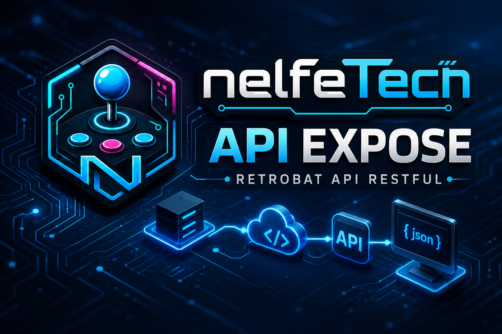

# Welcome

**APIExpose** is the engine that gives your RetroBat installation superpowers: automatic media, localized gamelists, ROM packs, smart scraping, collections, arcade data and a real-time local API that feeds the [MarqueeManager](https://nelfe80.github.io/RetroBat-Marquee-Manager/) and [LedManager](https://nelfe80.github.io/RetroBat-Led-Manager/) plugins.



## What APIExpose does

- **Media**: finds, organizes and projects screenshots, logos, boxarts, videos, manuals — your personal files always take priority.
- **Scraping**: local first, ScreenScraper when needed, with live updates of the current game's entry without reloading the list.
- **Localized gamelists**: descriptions, genres and data in EmulationStation's language, realigned when the language changes.
- **ROM packs and collections**: drop an archive, APIExpose imports it — with an on-the-fly mode for large packs.
- **Arcade data**: control-panel buttons, colors and layouts (dynpanels), per-game RAM definitions, high scores.
- **Local API and WebSockets**: everything is exposed on `http://127.0.0.1:12345` for plugins, themes and tools.

## Where to start?

<div class="grid cards" markdown>

- **[Getting started](premiers-pas.md)** — install APIExpose and check that it runs.
- **[Media and scraping](medias.md)** — your priority media and automatic scraping.
- **[ROMs and collections](roms.md)** — import packs and clean up your lists.
- **[Local API](api.md)** — endpoints and real-time streams for tools and themes.

</div>

!!! warning "Read this first"
    APIExpose is powerful: it can modify gamelists, media, EmulationStation settings, collections and theme files. **Back up** your RetroBat folder before using it on an installation that matters, or test on a copy.

## The ecosystem

```text
RetroBat / EmulationStation
   ↕ APIExpose (media, gamelists, events, local API)
        → MarqueeManager (marquee, topper, DMD, LCD)
        → LedManager (LED buttons, light panels)
        → your own tools (WebSocket + REST)
```
