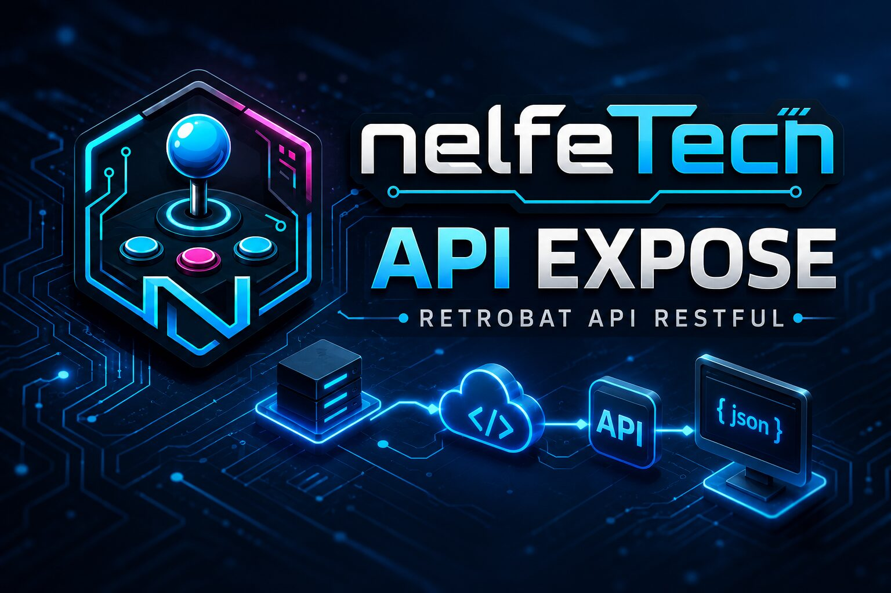

# Bienvenue

**APIExpose** est le moteur qui donne des super-pouvoirs à votre installation RetroBat : médias automatiques, gamelists localisées, packs de ROMs, scraping intelligent, collections, données arcade et une API locale en temps réel dont se nourrissent les plugins [MarqueeManager](https://nelfe80.github.io/RetroBat-Marquee-Manager/) et [LedManager](https://nelfe80.github.io/RetroBat-Led-Manager/).



## Ce que fait APIExpose

- **Médias** : trouve, range et projette screenshots, logos, boxarts, vidéos, manuels — vos fichiers personnels restent toujours prioritaires.
- **Scraping** : local d'abord, ScreenScraper si besoin, avec mise à jour de la fiche du jeu courant sans recharger la liste.
- **Gamelists localisées** : descriptions, genres et données dans la langue d'EmulationStation, réalignées quand la langue change.
- **Packs de ROMs et collections** : déposez une archive, APIExpose l'importe — avec mode « à la demande » pour les gros packs.
- **Données arcade** : boutons, couleurs et layouts des panels (dynpanels), définitions RAM des jeux, high scores.
- **API et WebSockets locaux** : tout est exposé sur `http://127.0.0.1:12345` pour les plugins, thèmes et outils.

## Par où commencer ?

<div class="grid cards" markdown>

- **[Premiers pas](premiers-pas.md)** — installer APIExpose et vérifier qu'il tourne.
- **[Menus et options](menus.md)** — toutes les options APIExpose dans EmulationStation.
- **[Médias et scraping](medias.md)** — vos médias prioritaires et le scraping automatique.
- **[API locale](api.md)** — endpoints et flux temps réel pour outils et thèmes.
- **[Guides par profil](https://nelfe80.github.io/NelfeTech-Guides/)** — joueurs, streamers, salles, organisateurs, assembleurs : les parcours pas à pas vivent sur leur propre wiki.

</div>

!!! warning "À lire avant"
    APIExpose est puissant : il peut modifier gamelists, médias, réglages EmulationStation, collections et fichiers de thème. **Faites une sauvegarde** de votre dossier RetroBat avant de l'utiliser sur une installation importante, ou testez sur une copie.

## L'écosystème

```text
RetroBat / EmulationStation
   ↕ APIExpose (médias, gamelists, événements, API locale)
        → MarqueeManager (marquee, topper, DMD, LCD)
        → LedManager (boutons LED, panneaux lumineux)
        → vos propres outils (WebSocket + REST)
```
